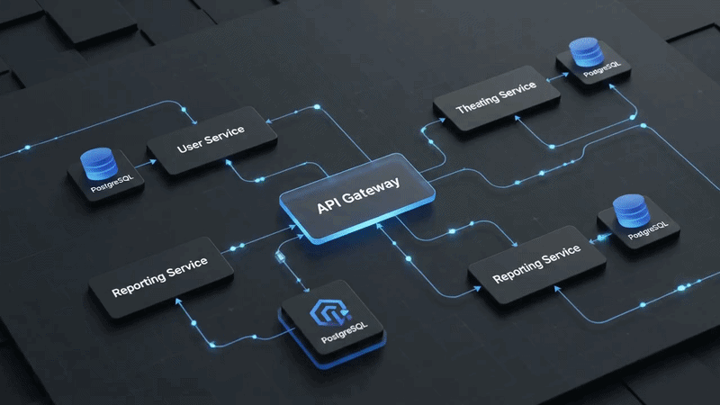

<div align="center">

# 🎭 Theatre Ticket Reservation System

### A production-grade microservices platform for booking theatre seats in real time.

**Spring Boot 3 · React 18 · PostgreSQL · JWT · Docker · API Gateway**

[](https://openjdk.org/)
[](https://spring.io/projects/spring-boot)
[](https://react.dev/)
[](https://www.typescriptlang.org/)
[](https://www.postgresql.org/)
[](https://www.docker.com/)
[](https://tailwindcss.com/)
[](#-license)

<br/>

<!-- Replace this with your own demo GIF/screenshot when you deploy -->
<div align="center">

  

  <br/><br/>

  <a 
    href="https://theatre-system.netlify.app" 
    target="_blank"
    style="
      font-size: 20px;
      font-weight: bold;
      text-decoration: none;
      padding: 12px 24px;
      border-radius: 10px;
      background-color: #ff4b2b;
      color: white;
      display: inline-block;
    "
  >
    🎭 GO LIVE
  </a>

</div>
</div>

---

## ✨ What is this?

> **In one line:** A full-stack web app where customers browse upcoming theatre shows, pick their seats from a visual seat map, pay, and manage their bookings - built with the same architecture patterns used by real-world ticketing platforms like BookMyShow and Ticketmaster.

### 👤 For non-technical visitors

Imagine you want to watch a play this weekend. You open the website, see what's showing, pick the show you like, look at the theatre's seat map, choose a seat (front row is pricier, back row is cheaper), and book it. The system makes sure no two people can book the same seat at the same time, lets you cancel if your plans change, and shows admins a separate panel to add new shows. **That's exactly what this project does - end-to-end.**

### 👨‍💻 For technical visitors

A **microservices** application that decomposes a monolithic ticketing system into four independent Spring Boot services behind an API Gateway:

- 🔐 **User Service** - Registration, login, profile (BCrypt + JWT)
- 🎭 **Theatre Service** - Shows, seat layout, pessimistic seat locking
- 🎟️ **Booking Service** - Buy/cancel orchestration, booking history, price summaries
- 🚪 **API Gateway** - JWT validation at the edge, path-based routing, CORS

Each service owns its own PostgreSQL database (database-per-service pattern), communicates over HTTP, and is independently containerised. The React frontend is a single-page app served by Nginx in production.

This started as a Java OOP coursework that was effectively a CLI program with hardcoded arrays. **It has been rebuilt as a real distributed system** while preserving every business rule from the original spec.

---

## 🏗️ Architecture at a Glance

```
┌────────────────────────────────────────────────────────────────┐
│                    🌐 React Frontend  (port 5173)              │
│         Vite · TypeScript · Tailwind · TanStack Query          │
└─────────────────────────────┬──────────────────────────────────┘
                              │  HTTPS · JWT in Authorization header
                              ▼
                  ┌──────────────────────────┐
                  │  🚪 API Gateway  :8080   │
                  │  • JWT validation        │
                  │  • Path-based routing    │
                  │  • CORS handling         │
                  │  • X-User-Id injection   │
                  └──┬─────────┬──────────┬──┘
        ┌────────────┘         │          └────────────┐
        ▼                      ▼                       ▼
┌──────────────────┐  ┌────────────────────┐  ┌────────────────────┐
│ 🔐 User  :8081   │  │ 🎭 Theatre :8082   │  │ 🎟️  Booking :8083  │
│  • Register      │  │  • List shows      │  │  • Buy seat        │
│  • Login (JWT)   │  │  • Create show     │  │  • Cancel booking  │
│  • Profile       │  │  • Seat map        │  │  • List bookings   │
│                  │  │  • Book/release    │  │  • Price summary   │
│   users_db       │  │   theatre_db       │  │   booking_db       │
└──────────────────┘  └─────────┬──────────┘  └─────────┬──────────┘
                                │                        │
                                │  X-Internal-Token      │
                                └────── service-to-service ──────┘

                  ┌────────────────────────────┐
                  │   🐘 PostgreSQL 16         │
                  │   3 isolated databases     │
                  │   Flyway migrations        │
                  └────────────────────────────┘
```

### Why this shape?

| Pattern | Why it's used here |
|---|---|
| **API Gateway** | Single entry point; perimeter-level JWT validation means downstream services trust an `X-User-Id` header instead of re-parsing tokens |
| **Database per service** | Each service evolves its schema independently; no shared tables, no hidden coupling |
| **Pessimistic locking** | Theatre seats are a scarce resource - optimistic locking would cause race conditions on a popular show |
| **Compensating actions** | The booking flow spans two services; if the booking DB insert fails, the seat lock is released to keep state consistent |
| **JWT (HS256, 1h)** | Stateless auth - services don't need a session store; the gateway validates once at the perimeter |

---

## 🧰 Tech Stack

<table>
<tr>
<td valign="top" width="50%">

#### Backend
- ☕ **Java 21** (records, pattern matching)
- 🍃 **Spring Boot 3.3**
- ☁️ **Spring Cloud Gateway** (reactive)
- 🔒 **Spring Security** + **JJWT**
- 🗄️ **Spring Data JPA** + **Hibernate**
- 🪶 **Flyway** for migrations
- 🐘 **PostgreSQL 16**
- 📦 **Maven** multi-module
- 📘 **Springdoc OpenAPI** (Swagger UI)
- 🧪 **JUnit 5** + **Mockito** + **H2**

</td>
<td valign="top" width="50%">

#### Frontend
- ⚛️ **React 18** + **TypeScript 5**
- ⚡ **Vite 5** (build tool)
- 🎨 **Tailwind CSS 3**
- 🔄 **TanStack Query** (server state)
- 🐻 **Zustand** (client state, persisted)
- 📝 **React Hook Form** + **Zod** (validation)
- 🌐 **Axios** (HTTP, with interceptors)
- 🧭 **React Router 6**
- ✨ **Lucide React** (icons)
- 🐳 **Nginx** (prod static serving)

</td>
</tr>
</table>

#### Infra & DevOps
🐳 **Docker** + **Docker Compose** · 🏥 **Healthchecks on every service** · 🔁 **Restart policies** · 🌐 **Single bridge network with DNS discovery**

---

## 🎨 Key Features

### 🎟️ For ticket buyers
- 🖼️ **Visual seat picker** with three colour-coded price tiers
- ⚡ **Real-time availability** - booked seats are greyed out the moment someone else books them
- 🔐 **Secure registration & login** with NIC and email validation
- 📜 **Booking history** with one-click cancel and price totals
- 🔃 **Server-side sorting** by price (no client-side trickery)
- 📱 **Responsive layout** - works on mobile, tablet, desktop

### 🛠️ For admins
- ➕ **Create Show** form auto-generates the full 48-seat layout with tiered pricing
- 🛡️ **Role-based UI** - admin links only appear when logged in as admin
- 🚫 **Backend role enforcement** - calling an admin endpoint with a user token returns `403` cleanly

### 🧠 Under the hood
- 🛡️ **No double-bookings, ever** - pessimistic DB locking on seat operations
- 💥 **Compensating transactions** - if booking insertion fails, the seat is released
- 🔍 **RFC 7807 problem details** - every error response is structured and machine-readable
- 🩺 **Spring Actuator** healthchecks on every service
- 🔄 **Database migrations versioned** - Flyway tracks every schema change
- 📋 **Swagger UI** auto-generated per service

---

## 🚀 Quick Start

### Prerequisites

You only need **one** thing locally:

- 🐳 **Docker Desktop** ([Download here](https://www.docker.com/products/docker-desktop/))

Everything else (Java, Maven, Node, Postgres) runs inside containers.

### Run the whole stack

```bash
git clone https://github.com/<your-username>/theatre-system.git
cd theatre-system
docker compose up --build
```

⏳ **First build:** ~8–12 minutes (downloads Maven deps + builds 4 Spring services + npm install + Vite build).
⚡ **Subsequent builds:** seconds, thanks to Docker layer caching.

Wait until `docker compose ps` shows every service as `(healthy)`, then open:

| URL | What |
|---|---|
| 🌐 **<http://localhost:5173>** | **The app** (React frontend) |
| 🚪 <http://localhost:8080> | API Gateway |
| 📘 <http://localhost:8081/swagger-ui.html> | User Service API docs |
| 📘 <http://localhost:8082/swagger-ui.html> | Theatre Service API docs |
| 📘 <http://localhost:8083/swagger-ui.html> | Booking Service API docs |

### Stop it

```bash
docker compose down            # stop containers
docker compose down -v         # stop AND wipe the database
```

---

## 🧪 Running the Tests

```bash
mvn test                       # run all backend tests
cd booking-service && mvn test # run one service's tests
```

| Test class | What it locks in |
|---|---|
| `TheatreLayoutTest` | 12/16/20 seat counts and $10/$20/$30 pricing |
| `SeatServiceIntegrationTest` | 48-seat auto-generation, range validation, no double-booking, release on cancel |
| `AuthServiceTest` | Register, login, duplicate email/NIC, wrong password |
| `BookingServiceTest` | Buy/cancel flow, compensating release on DB-insert failure, summary math |

---

## 📂 Project Structure

```
theatre-system/
├── 🐳 docker-compose.yml          # one command to run everything
├── 🔧 .env.example                # copy to .env and adjust
├── 🗃️  infra/init-db.sql           # creates per-service databases
├── 📦 pom.xml                     # parent Maven module
│
├── 🚪 api-gateway/                # Spring Cloud Gateway (port 8080)
│   ├── Dockerfile
│   └── src/main/java/com/theatre/gateway/...
│
├── 🔐 user-service/               # Auth + JWT issuance (port 8081)
│   ├── Dockerfile
│   └── src/main/java/com/theatre/user/...
│
├── 🎭 theatre-service/            # Shows + seats (port 8082)
│   ├── Dockerfile
│   └── src/main/java/com/theatre/theatre/...
│       └── entity/TheatreLayout.java  ← coursework rules live here
│
├── 🎟️  booking-service/            # Bookings (port 8083)
│   ├── Dockerfile
│   └── src/main/java/com/theatre/booking/...
│
└── ⚛️  frontend/                   # React + Vite + Tailwind (port 5173)
    ├── Dockerfile
    ├── nginx.conf                 # SPA fallback routing
    └── src/...
```

---

## 📡 API Documentation

Each service auto-generates interactive Swagger UI:

| Service | Swagger URL (local) | Highlights |
|---|---|---|
| User | <http://localhost:8081/swagger-ui.html> | `POST /api/v1/auth/register`, `POST /api/v1/auth/login`, `GET /api/v1/users/me` |
| Theatre | <http://localhost:8082/swagger-ui.html> | `GET /api/v1/shows`, `POST /api/v1/shows` (admin), `GET /api/v1/shows/{id}/seats` |
| Booking | <http://localhost:8083/swagger-ui.html> | `POST /api/v1/bookings`, `DELETE /api/v1/bookings/{id}`, `GET /api/v1/bookings/me`, `GET /api/v1/bookings/me/summary` |

All client requests in production should go through the gateway at `/api/v1/...`.

---

## 🧠 Engineering Decisions

### Things that are in this project, and why

| Choice | Rationale |
|---|---|
| Microservices, not monolith | Demonstrates service decomposition, inter-service auth, and gateway patterns - the things real teams need |
| Database per service | Prevents the "shared DB anti-pattern" - services can evolve schemas independently |
| Pessimistic locking on seats | Seats are a scarce, contested resource - optimistic locking would fail under contention |
| JWT at the gateway | Services trust an `X-User-Id` header instead of each parsing tokens - less duplication, faster |
| Flyway migrations | Every schema change is reviewed, versioned, and reproducible |
| Hand-rolled UI components | No `shadcn` install bloat - clean Tailwind components you can read in 50 lines each |

### Things that are deliberately **not** in this project

| Tempting addition | Why skipped |
|---|---|
| Service discovery (Eureka, Consul) | Docker DNS handles 4 services fine - Eureka is overkill below ~20 services |
| Config server (Spring Cloud Config) | Environment variables cover dev/prod differences for a project this size |
| Message broker (Kafka, RabbitMQ) | No async workflows yet - adding one would be cargo-culting |
| Kubernetes | Compose is the right tool for portfolio-scale; K8s would obscure the actual code |
| OAuth2 provider | JWT + BCrypt is sufficient - adding Keycloak would 10x the operational surface |

---

## 🤝 Contributing

This started as a university coursework project but is open to learning contributions. If you'd like to extend it:

1. Fork the repo
2. Create a feature branch (`git checkout -b feat/awesome-feature`)
3. Commit your changes (`git commit -m 'Add awesome feature'`)
4. Push to the branch (`git push origin feat/awesome-feature`)
5. Open a Pull Request

---

## 📜 License

Released under the [MIT License](./LICENSE). Free for portfolio, coursework, and commercial use.

---

<div align="center">

### Built with ☕ Java, 💛 TypeScript, and a lot of debugging.

If this project helped you learn something, leave a ⭐ - it makes my day...

</div>
